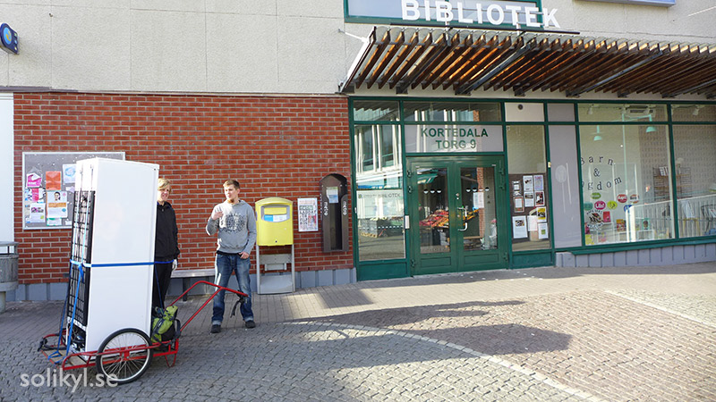

In den vergangenen Beiträgen schrieb ich über Solikyl, die foodsharing Initiative in Gotheburg, über Schwierigkeiten und über die Computerprogramme, die wir nutzen um uns zu organisieren und auszutauschen. Dieser letzte Beitrag behandelt die Strategien und Visionen, die wir für die Zukunft haben.

Die Vision ist natürlich solidarische Kühlschränke in der Stadt zu verteilen um mehr Betriebe dazu zu bringen mit uns zu kooperieren und letzendlich die Lebensmittelverschwendung sichtbar einzudämmen. Doch es gibt Wege und Wege dies zu tun. Es gibt weder den Bedarf ein Geschäft daraus zu machen, noch es als Wohltätigkeitsorganisation für die Ärmsten aufzuziehen, dies zieht nur stigmatisierende Grenzen mit sich.

Von Anfang an haben wir, die Organisierenden, diese Initiative nicht als eine von-oben-herab-Organisation oder als Geschäftsmodell gesehen. Eigentlich brauchen wir gar nicht so viel Geld (alle unserer Ausgaben haben wir bisher mit Pfandeinnahmen von unserem ersten solidarischen Kühlschrank gedeckt). Natürlich benötigen wir Ressourcen, die wichtigsten sind Zeit, Fähigkeiten und Engagement von Menschen.

Dinge wie z. B. Kühlschränke, benutzt und doch voll funktionsfähig, sind auch als Spende erhältlich in dieser im Überfluss schwimmenden Gesellschaft. Daher ist es nur eine Frage diese zu finden.

Bis jetzt bekamen wir diese über Facebook-sharing-Gruppen und ähnliche Spenden-Websites. Auch Orte gibt es genügend. Daher ist es nur eineFrage der Vernetzung - die richtigen Orte finden und mit den richtigen Leuten reden die ähnliche Werte teilen. Nun, wie bereiten wir die Grundlage um solche Dinge in größerem Maßstab zu tun?

 *Solidarische Kühlschränke and Orten aufstellen, die eh schon auf das Teilen eingestellt sind; eine Bibliothek
 

Eine besondere Strategie ist, dass wir in Partnerschaft mit der Stadt arbeiten. Wir diskutieren die Möglichkeit die ausrangierten, noch funktionsfähigen Kuhlschränke von den Abfallstationen zu bekommen und diese an öffentliche Orte, wie Bibliotheken zu stellen. Einige legale Fragen scheinen nun geklärt zu sein.

Wir wissen, dass die Orte, an denen die Kühlschränke stehen nicht für die Lebensmittelsicherheit von Foodsharing auf ihren Grundstücken verantwortlich sind. Ebenfalls wissen wir, dass Spenderbetriebe nicht für die Lebensmittel, die in den Kühlschränken und Foodsharing-points landen haftbar sind. Daher arbeiten wir derzeit an Kommunikationsmaterial um zukünftige Kooperationen anzusprechen (siehe auch [part 2](/blog/2017/04/21/foodsharing-gothenburg-part2)).

Schlussendlich, wenn alle Teile des Puzzels zusammengebracht sind werden wir die Bedingungen, um Foodsharing in Gotheburg auf dezentralisierte Art und Weise zu vergrößern und ohne überwältigende Mengen an Arbeit für die Kerngruppe zu erfordern geschaffen haben.

Solikyl wird nur die Werkzeuge bereitstellen (siehe auch [part 3](/blog/2017/04/27/foodsharing-gothenburg-part3)), Wissen, Kontakte, Unterstützung usw. für lokale Nachbarschaften, die anfangen möchten Lebensmittel zu retten, die sonst im Müll gelandet wären. Auf eine Art und Weise, die das Teilen und Solidarität unterstützt.

Lass mich ein Beispiel geben was es heißt eine dezentralisierte, solidarische Infrastruktur aufzubauen. Letztes Mal, als ich am "transition-workshop" war, der Ort an dem unser erster und aktivster Kühlschrank steht, sah ich Menschen, die kamen und gingen. Nicht nur um einige Lebensmittel mitzunehmen, sondern auch um selber einiges dort zu lassen.

Einer kam gerade von einer container tour mit eingem an Brot und Würsten während eine Frau später mit einigen Snacks kam, die von einem Händler gespendet worden waren, da ihr Mindesthalbarkeitsdatum abgelaufen war. Vielleicht hatte ich diese Menschen bereits gesehen, jedoch kannte ich sie nicht und sie zählten nicht zu den Foodsavern die uns kontaktierten um Lebensmittel mittels des foodsaving-tools in Betrieben zu retten.

Was hier geschieht ist, dass dieser Foodsharing-point (Fairteiler), mit dem Kühlschrank, der Regalen und den großen Ikea-Boxen (ja, so schwedisch...), in denen wir Brot haben eine grundlegende Infrastuktur legt, die Menschen benutzen können um Lebensmittelüberfluss zu Teilen.

Es gibt keinen Bedarf für 24/7 Betreuung des Kühlschrankes durch irgendeine formelle Organisation (eine Firma oder öffentliche Behörden), welche für das Geben und Nehmen, das an dem Fairteiler stattfindet verantwortlich sind. Es gibt keinen Bedarf für einen Chef, sei es von einer Firma order einer Wohltätigkeitsorganisation um die Interaktionen zu organisieren oder zu diktieren, die hier statfinden.

Dies ist einer der effizientesten Wege, denken wir, um die Lebensmittelverschwendung zu bekämpfen. Zusätzlich und vielleicht wichtiger fördert dieses Modell echtes Teilen und ist offen genug um Menschen zu ermächtigen: ihnen Werkzeuge und Wissen zu geben um aktive Vertreter des Wandels zu sein und sie nicht nur auf ein passives Konsumieren oder Annehmen von Almosen zu limitieren.

Ich freue mich über Beträge auf diesem Blog und bin interessiert über ähnliche Initiativen in anderen Städten zu lernen!