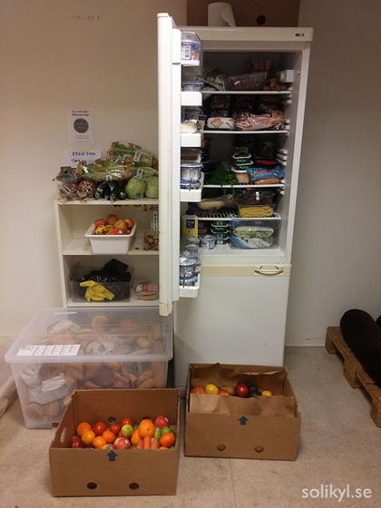

On the previous posts I wrote about Solikyl, the foodsharing initiative in Gothenburg, about the challenges we face and the tools we use to connect and organize ourselves. This final post is all about the strategies and visions we have for the future.

The vision is obviously to spread solidarity fridges across the city, to get more food shops to cooperate and ultimately to minimize food waste considerably. But there are ways and ways to do it. There is neither a need to make a business out of it, nor to make it as a charity that targets the poorest, creating stigmatization barriers.

From the very beginning we who organized this did not view this initiative as some kind of top-down non-profit or as a business model. In fact, you don’t need much money at all (all of our expenses have been paid so far with recycled bottles collected where the first solidarity fridge is). Of course, what you need is resources, the most important of them being people’s time, skills and commitment.

Things like fridges, used but fully functional, are also available to donation in this abundant and affluent society, so the question is finding them.

So far we got them on Facebook sharing groups and similar donation websites. Places are also available, so the trick is to find the right places and talk to the right people who share similar values. Then how are we preparing the ground to do all of this on a larger scale?

 _Bringing a solidarity fridge to a natural place for sharing, a library._

One particular strategy that we are working on is a partnership with the city. We are discussing the possibility of getting the discarded and working fridges from the waste stations and using the public spaces, like libraries, to place them. Some legal questions seem to be cleared now.

We know that the places housing the fridges are not liable for food safety regarding foodsharing in their premises. We also know now that partners who donate are not liable for the food ending up at the fridges and food sharing points, so we are currently working on communication material to approach future partnership (see also [part 2](/blog/2017/04/21/foodsharing-gothenburg-part2)).

Finally, when all the pieces of this puzzle are put together we will have the conditions to expand food sharing in Gothenburg in a more decentralized matter, which does not require an overwhelming amount of work from the core group.

Solikyl will only provide the tools (see also [part 3](/blog/2017/04/27/foodsharing-gothenburg-part3)), know-how, contacts, support, etc. for the local neighbourhood communities who want to start rescuing food that would have gone to waste, doing it in a way that behaviours of sharing and solidarity are encouraged.

Let me give you an example about what creating a decentralized solidarity infrastructure means. Last time I was at the transition workshop, the place where our first and most “active” fridge is, I could observe people coming and going, not only to get some food, but also to leave stuff on their own account.

One guy had just come from his dumpster-diving tour with some bread and sausages, while a woman came later with some snacks that were donated directly from a distributor, because the best-before date on these snacks had expired. I might have seen these people there before, but I did not know them, and they were not among the foodsavers who contacted us to pick up food at the store, using the foodsaving tool.

What happens here is that this food sharing point, with the fridge, the shelves and the big IKEA boxes (yes, so Swedish...) where we have bread constituted a very basic infrastructure that people could use to engage in the act of sharing whatever food excess they have or find.

There is no need for constant supervision of the fridge by any kind of formal organization (a company, a charity or public authorities), which would be responsible for the giving and taking happening on this food sharing point. There is no need either for a boss, whether from a company or from a non-profit, to organize or dictate how these interactions are going to take place.

This is actually one of the most efficient ways we believe there is to fight food waste, and perhaps more importantly, this kind of model promotes real sharing and is open enough to empower people, giving them the tools and knowledge to be active agents of change, and not merely limiting them to be passive consumers or receivers of charity.

I’m looking forward to read other contributions on this blog and to get to know more about similar initiatives in other cities!