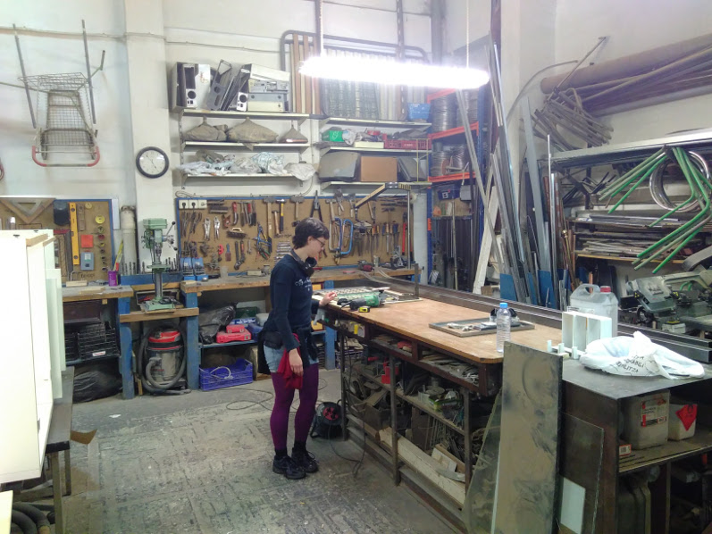

Leire und ich (Unai) haben die Energie von foodsharing Kopenhagen gesehen und wollten das auch hier in Bilbao ausprobieren. Etwa Ende 2016 haben wir ein Meeting bei [Sarean](https://www.facebook.com/sareangunea/) arrangiert, das zwei weitere Leute angezogen hat: Ione und Laura.

Wir haben beschlossen eine [Facebook Gruppe](https://www.facebook.com/groups/1853289058224368/?ref=bookmarks) zu gründen, um Leute einzuladen und ein weiteres Meeting zu halten, sobald mehr Leute erreichbar sind. Das zweite Treffen hat nie stattgefunden; zum Glück aber kannte Laura Joachim (von [yunity](https://www.yunity.org)) und er hat vorgeschlagen, dass wir bei ein paar [Online Meetings](https://drive.google.com/open?id=0B0c-rM4MZX0XdERVTy1IVUN0aVU&noprocess) teilnehmen, wo wir die Basics von foodsharing kennenlernten.

Joachims Ratschlag befolgend wagten wir den ersten Schritt: [Flyer übersetzen](https://drive.google.com/open?id=0B0c-rM4MZX0Xc1dzWHFvN2VHUEE&noprocess), [Betriebe ansprechen](https://drive.google.com/open?id=1IPgyuLC2Sjsz7vnXTh-D636wObI_kISLdsegsF9TU1U&noprocess), nach möglichen Fair-Teiler Orten suchen und einige Kontakte knüpfen, mögliche Orte kontaktieren, die Platz für Präsentationen, Workshops und das Bauen eines Fahrradanhängers bieten.

 *Janina in Recrea2, wo wir zwei Wochen später an dem Fahrradanhänger arbeiten.*

Joachim plante Ende März mit Janina nach Bilbao zu kommen, um die Bewegung mit zu starten. [Und das haben sie gemacht!](https://yunity.atlassian.net/wiki/display/FSINT/Kickstarting+foodsharing+Bilbao)

Die erste Abholung überhaupt fand bei Panadería Buenos Aires einige Tage vor ihrer Ankunft statt, aber sobald sie da waren, hat sich alles beschleunigt: Wir haben ein [Einführungstreffen](https://www.facebook.com/events/183695715476690/) im[Bilbiko Kultur Etxea](https://www.facebook.com/bilbikokulturetxea/) organisiert, eine Zusammenarbeit mit [Ecorganic](https://www.facebook.com/pages/Ecorganic-Bilbao/1710629755857150) geschaffen und angefangen täglich (außer sonntags) abzuholen, den Fahrradanhänger halb fertig gebaut in [Recrea2](https://www.facebook.com/Recrea2.Bilbao/) und einige Kontakte wie [Karmela Squat](https://www.facebook.com/Karmela-1029527180427399/) oder Álvaro von [Nevera Solidaria](https://www.facebook.com/neverasolidaria/) geknüpft. Es waren zwei richtig produktive und doch sehr entspannte Wochen. Vielen Dank Leute!

 *Alvaro und Unai.*

Als die yunity Leute weg waren ging alles langsamer voran, aber seitdem läuft es trotzdem kontinuierlich. Die Zusammenarbeit mit Ecorganic wird immer stärker und wir haben nur eine Abholung nicht geschafft; vier Leute haben die [ Haftungsvereinbarung](https://drive.google.com/open?id=0B0c-rM4MZX0XUWs3b2N2QkZnS0U&noprocess) unterzeichnet und mindestens eine Abholung gemacht. Auf der anderen Seite ist die Kooperation mit Panadería Buenos Aires sehr schwach, weil sie dort kaum mehr Reste haben. Wir haben wöchentliche Foodshare Events im Karmela und Bilbiko Kultur Etxea. Wir haben große Supermärkte wie Lidl und ALDI kontaktiert. Wir werden foodsharing Bilbao bei einem Event, das von dem Space Exchange Network organisiert wird, und bei einer Versammlung in der Nachbarschaft präsentieren und Essen zubereiten. Wir wurden eingeladen eine Schnippeldisco in Sarean zu organisieren, die bald oder nach diesem Sommer stattfinden wird. Wir werden bald live in auf einem lokalen Radiosender zu hören sein. Wir sind aktiv!

Die Bewegung ist noch klein wie ein Baby, aber wir haben keine Eile zu wachsen. Alles passiert dann, wenn es passieren soll. :)