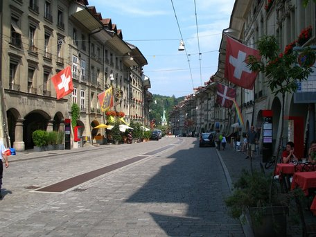

Ihr Lieben

Ich wurde gebeten, hier einmal den Status Quo der Schweiz zu erfassen. Mache ich natürlich gerne. Ich weiss nicht so genau, was alles interessant ist, daher [fragt gerne nach]((mailto:peter.toennies@gmail.com)).

### Erst mal ein paar spröde Zahlen
* 1161 Foodsaver, 20 Botschafter, 244 Betriebe, 99 laufende Kooperationen
* 112.175,00 kg Lebensmittel gerettet bei 10178 Rettungs-Einsätzen
* Tatsächlich aktiv sind meines Wissens nach 12 Botschafter.
* Es gibt 12 Bezirke, von denen 5 tatsächlich aktiv sind. Basel, Bern, Zürich, Luzern und Zug.

### Zur Struktur
Wir haben in letzter Zeit die Bezirke vergrössert und kantonsweit (Kantone sind bei uns die "Bundesländer") organisiert. So haben wir eine grössere Abdeckung und recht klare Grenzen. Es gibt noch 6 weitere Kantone, die wir mit Aushilfsbotschaftern besetzt haben. So bekommen wir fast immer mit, wenn sich jemand anmeldet, jeder fühlt sich irgendwo zugehörig und wir können beim Aufbau neuer Gruppierungen helfen. Die grossen Bezirke sind gut für die Vernetzung und vermindern natürlich auch übermässige Administration.

Leider sind ein paar deutschsprachige Kantone und (bis auf Genf) alle (für mich) fremdsprachigen Kantone noch nicht abgedeckt. Im Grunde wäre es gerade in den Grenzgebieten eine gute Chance, polyglotte Foodsaver zu finden, aber leider weiss ich gar nicht so genau, wo und wie an der Übersetzung unserer Homepage gearbeitet wird. Rein theoretisch bestünden hier u. U. realistische Chancen auf den Einstieg ins Französische und Italienische. Das mal für den Hinterkopf.

### Zur Orga
Wir sind recht klein und kennen uns gegenseitig in vielen Fällen. Das ganze Land ist nicht übermässig gross, weshalb ein Austausch generell machbar ist, so denn nötig. Wie in Deutschland haben wir auch ein Landesforum, welches bei uns aber klappt und auch genutzt wird. Sind halt nicht so schrecklich viele Leute drin, die die Homepage in die Knie zwingen.
Neben den Bezirks-Adressen führen wir eine landesweite E-Mail-Adresse info@foodsharingschweiz.ch, welche auch immer reger für Kontaktanfragen aus unserem Umfeld genutzt wird. [www.foodsharingschweiz.ch]((https://foodsharingschweiz.ch/)) ist unsere offizielle Domain. Sehr unschön in meinen Augen, aber foodsharing.ch ist leider bisher nicht erwerbbar.
Neben ein paar mehr oder weniger aktiven Facebook-Seiten haben wir dann noch [eine Wiki-Seite](https://wiki.foodsharing.de/Schweiz) anzubieten.

### Unser Umfeld
Es gibt in der Schweiz ziemlich viele Einrichtungen, die sich mit unserer Thematik oder aber deutlich karitativerem Umgang mit Lebensmitteln widmen. Wir geben uns Mühe, uns mit diesen zu vernetzen. Auf unserer Karte seht Ihr einige auch eingetragen. Neue FS in diesen Regionen können wir so schnell zu Alternativen lotsen. Zudem können wir bei Anfragen von Firmen etc. in vielen Fällen schnell eine Lösungsmöglichkeit in deren Nähe aufzeigen.

### Ein Vergleich zu Deutschland
Im Grunde halten wir uns an das original Reglement. Oft besteht kein Bedarf das zu ändern. Die Fair-Teiler haben zum Teil strengere Regeln. Das kommunizieren wir dann gleich am FT selbst. Die Rechtevereinbarung ist vermutlich für uns auch nicht 100 % anwendbar. Es kann manchmal komisch sein, auf die deutschen Vorlagen zu verweisen und teils ist es auch einfach gar nicht vollständig passend, aber bisher hatten wir noch keine Problem hiermit.
Das Thema "Vereine" ist bei uns derzeit auch aktuell. Zug ist bereits einer und Zürich wird gerade einer. Einerseits, weil wir natürlich in Deutschland mitlesen und andererseits, weil sich uns neue Kooperationsmöglichkeiten bieten und wir und sogar das Attribut "Gemeinnützigkeit" erhoffen. Vereinsgründung ist hier einfacher als in D. Ein schweizweiter Verein wäre u. U. auch sinnvoll. Aber noch nicht in Arbeit.

### Akzeptanz in der Gesellschaft
Das Thema Foodwaste kommt hier, vermutlich wie auch bei Euch, derzeit sehr in Mode. Es wird viel darüber gesprochen und es herrscht allgemein grosses Interesse und Wohlwollen. Anfragen aus Wirtschaft, Presse, Bildungssektor... nehmen (nach meinem Gefühl) zu. Wir können hier tatsächlich als Berater und Unterstützer auftreten. Wenn ein Betrieb unsere Hilfe erbittet, ist die Koop natürlich einfacher und weniger steif.
Die Fair-Teiler werden gut geleert und es gab noch keine grossen Probleme mit Ämtern. Wir sind aber auch streng mit uns selbst.
Es ist teils (hier spreche ich insbesondere für Zürich) gar nicht so einfach, grosse Mengen Essen loszuwerden. Die karitativen Einrichtungen arbeiten sehr effektiv, die Standards sind hoch, die Möglichkeiten eines hohen Personaleinsatzes teils nicht so gross und ganz allgemein ist glücklicherweise der Bedarf an Lebensmitteln an vielen Stellen gedeckt. In Zürich haben wir somit oft mit zu viel Lebensmitteln zu tun. Vermutlich ein Unterschied zu anderen Bezirken.

### Sonst so
Es gibt derzeit zwei BOTs mit Orga-Rechten in CH. Das sind Tilman P. und ich (Peter T.). Wir holen uns unsere Verstossmeldungen selbst aus dem System. Sehr überschaubar.

### Zu mir
Noch ganz schnell. Ich bin eigentlich Kölner, habe in Aachen studiert. Gucke also immer recht interessiert nach NRW. Seit 5 Jahren in der Schweiz und foodsharing hier bei der Suche nach ner Bohrmaschine in der Nachbarschaft entdeckt. Derzeit Botschafter von fünf Kantonen, Weiterleiter aller D und CH Verstossmeldungen, manchmal Nervensäge im IT-Team...
Ich muss gestehen, ich bin derzeit stolz, wie unsere Bezirke laufen. Haben ein tolles Team. Ihr seid herzlich eingeladen, einfach mal reinzuspinksen. Stehe für alle Fragen immer zur Verfügung.

Lieben Gruss, Peter im Namen Eurer vielen Kollegen in der Schweiz

<i>Fotos von
<a href="https://commons.wikimedia.org/wiki/User:Thisisbossi">Andrew Bossi</a>,
<a href="https://commons.wikimedia.org/wiki/User:Schulerst">Schulerst</a> and
<a href="https://commons.wikimedia.org/wiki/User:MadGeographer">MadGeographer</a>.</i>
