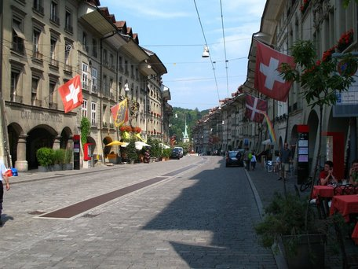

Dear all,
I’ve been asked to tell about the situation in Switzerland which I’ll gladly do. I’m not so sure what could be interesting, so [feel free to ask](mailto:peter.toennies@gmail.com) for more info.

### First of all some random numbers
* 1161 foodsavers, 20 ambassadors, 244 stores, 99 cooperations
* 112.175kg saved food from 10.178 pick-ups
* 12 ambassadors are active on a daily basis
* 12 districts, 5 are actually active: Basel, Bern, Zurich, Luzern and Zug.

### How we are structured
We recently enlarged the districts and are organized in our [cantons](https://en.wikipedia.org/wiki/Cantons_of_Switzerland), so we can cover more areas and have clearer borders. There are six more cantons with assistant ambassadors, that way we usually know when there’s a new sign-up, everybody belongs to some district and we can help build up new groups. The big districts are good for networking and decrease the annoying overhead of administration.

Sadly there are some cantons that aren’t covered by foodsharing, some German-speaking ones and (except Genf) all of the non-German-speaking ones. It would be easy to find polyglot foodsavers in the borderlands, but I don’t really know, where and how the translation of the website is going on. But just to keep it in mind: This could be a start for foodsharing in French and Italian language.

### How we are organized
We are small and most of us know each other. Switzerland isn’t big, so staying in contact is quite easy when necessary. Like in Germany we have a country-wide forum, but ours works and is used: Since we are not that many people that put pressure on the platform, in our case  it doesn’t break. Furthermore we have the country-wide mailing address info@foodsharingschweiz.ch, which also is increasingly used by people from the surroundings, who want to get in contact. Our domain is [foodsharingschweiz.ch](https://foodsharingschweiz.ch/). Not very pretty, but, so far we couldn’t get foodsharing.ch.
Apart from some more or less active facebook pages we also have a [page on the foodsharing.de wiki](https://wiki.foodsharing.de/Schweiz).

### Our surroundings
In Switzerland there are a lot of initiatives dedicated to our topic and even more charities handling food. We try to build a joint network with them and some are already listed on our map. This way we can show new foodsavers some alternatives in their regions quite easily. And we sometimes can find local solutions in case of companies requesting help from us.

### Comparison to Germany
Basically we abide by the same rules. Often there is no need to change anything. We have stricter rules at the food-share points. But we communicate this at the food-share point itself. Also the legal agreement isn’t 100% the same. It happens that referring to the German guidelines gets weird and sometimes it just doesn’t fit but so far there were no problems.  
Right now associations are a hot topic in Switzerland as well. Zug already is one and Zurich is about to become an association. On the one hand it’s because we know what’s happening in Germany, on the one hand we see new cooperation possibilities arise. Also, we hope to be granted the term “charitable”.  Founding an association is a lot easier here than in Germany. An association for the whole of Switzerland could also make sense, but it is not being worked on yet.

### Acceptance in society
Food waste is a topic, that is discussed a lot at the moment, as you probably know. People talk about it and there is a common interest and goodwill. I have the feeling that requests from different public sectors like economy, press and education increase. We can become professional  advisers and supporters in this context. Also, a cooperation born from a store asking for help is easier and less stiff, of course.  
The food-share points are frequently used and there have not been big problems with the authorities so far. But we are quite strict with ourselves.  
Speaking for Zurich it sometimes is not so easy to get rid of big amounts of food. Charities work effectively but with high standards. They are not so likely to dispatch a lot of staff and luckily in general their demand for food is already covered. So in Zurich we usually have way too much food. This is maybe different in other districts.

### What else
At the moment there are two ambassadors with the orga rights in Switzerland _(translator’s note: This refers to specifics of how the German platform is organized. People with orga rights basically can do everything on the platform)_. It’s Tilman P. and me (Peter T.). We take the violation reports directly from the system which is manageable. _(yet another translator’s note: If you’re interested in the functionality of the foodsharing.de platform you can watch [this 5 minute video](https://www.youtube.com/watch?v=8luGiP7cE2c) whith English subtitles.)_

### About me
In short: I’m actually from Cologne and studied in Aachen. So I sometimes still glimpse over to NRW. I’ve been in Switzerland for 5 years and discovered foodsharing while looking for a drill in the neighbourhood. I’m ambassador of 5 cantons right now, transmitter of all the violations in Germany and Switzerland, sometimes a bug the IT-team…  
I’m really proud of how things are going in our districts. We have a great team. You are hearitly invited to have a glimpse inside. We are open for questions.

Warmest regards,  
Peter in the name of all the Swiss fellows

<i>Photos by
<a href="https://commons.wikimedia.org/wiki/User:Thisisbossi">Andrew Bossi</a>,
<a href="https://commons.wikimedia.org/wiki/User:Schulerst">Schulerst</a> and
<a href="https://commons.wikimedia.org/wiki/User:MadGeographer">MadGeographer</a>.</i>
