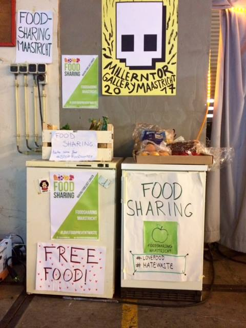
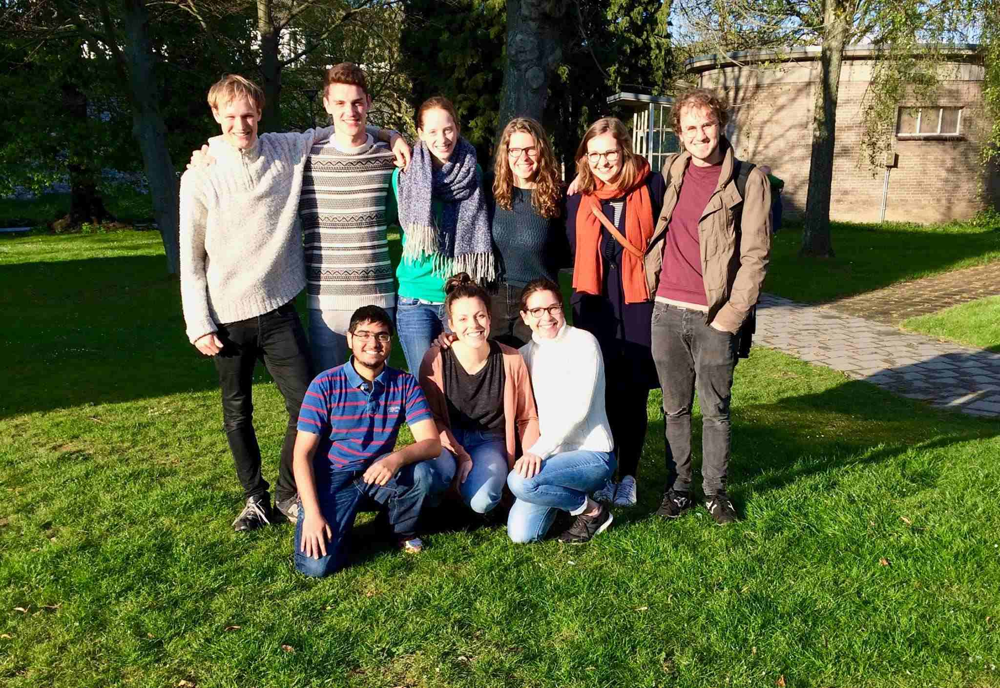

Die Idee foodsharing Maastricht zu gründen kam im Januar 2017 auf. Nachdem wir etwas dazu auf facebook gepostet hatten, bekamen wir direkt Unterstützung aus der von Studierenden betriebenen Nachhaltigkeitsabteilung der Universität Maastricht. Das so genannte [Green Office](https://www.greenofficemaastricht.nl/) unterstützt Studierendeninitiativen, die sich der Erhöhung der Nachhaltigkeit der Universität annehmen.

Das Timing war super: In der Uni lief gerade ein Ideenwettbewerb zur Verbesseung des Unilebens. Wir nahmen mit foodsharing Teil und nach einigen Workshops und zwei Runden konnten wir uns über ein schönes Preisgeld freuen.

Durch diesen Wettbewerb konnten wir uns einen Raum in der Uni sichern, in dem wir nun das gerettete Essen lagern. Davon abgesehen ist die generelle Unterstützung der Uni unbezahlbar. Nach der finalen Runde ging alles sehr schnell: Zwei Wochen später hatten wir bereits einen kleinen Raum im Universitätsgebäude im Herzen Maastrichts und über facebook konnten wir einige gespendete Regale und Kühlschränke ergattern.

Der zweite Aspekt - der Teamaufbau - zeigte uns wieviele motivierte Studierende es in Maastricht gibt. Gemeinsam mit dem Green Office veranstalteten wir einen Informationsabend, um Interessierte zusammenzubringen und unseren Bekanntheitsgrad zu erhöhen. Durch dieses Event haben wir unsere ersten Mitstreiter gefunden. Jetzt - ein halbes Jahr später - sind sie immernoch ein wichtiger Teil unseres Teams.

Wir haben eine [Facebook Gruppe](https://www.facebook.com/FoodSharingMaastricht/) erstellt unhd danach eine Page, auf der uns nach und nach Menschen angeschrieben haben, die Foodsaver werden wollten. Zu diesem Zeitpunkt hatten wir allerdings noch keine Kooperationen mit Betrieben. Wir wollten erstmal einen Raum und ein Team haben, damit wir die Abholungen dann auch wirklich zuverlässig durchführen können.

Es war allerdings nicht so einfach, wie wir gedacht hätten, Supermärkte von einer Kooperation mit uns zu überzeugen. Die ersten, die wir fragten, haben alle abgelehnt. Kleinere Märkte sagten immer sie würden nichts wegwerfen (was schwer zu glauben ist), oder dass sie ihren Überschuss anderweitig verwerten (was toll ist). Die wirklich großen Fische, die riesigen Supermärkte, kooperieren bis jetzt überhaupt nicht. Sie haben Angst um ihr Image, vor zusätzlicher Arbeit und sie sind generell der Idee gegenüber nicht aufgeschlossen mit einer kleinen Studierendeninitiative zusammenzuarbeiten. Es ist frustrierend zu sehen, dass immernoch soviele Menschen und Betriebe in den Niederlanden nicht bereit sind sich gegen Lebensmittelverschwendung einzusetzen.

Aus diesem Grund wollen wir nach der Sommerpause mehr Fokus auf Events und Kampagnen zur Stärkung des Bewusstseins für dieses Thema legen. Wir wollen weiter wachsen, um noch mehr Menschen zu erreichen und schließlich die nötige Bedeutung zu erlangen, dass auch große Supermärkte uns ernst nehmen und mit uns kooperieren wollen. Wenn nur genügend ihrer Kunden unser Anliegen unterstützen wird der Druck auf die Supermärkte irgendwann groß genug sein, um sie zum Umdenken zu bringen.

Seit Kurzem führen wir bei drei kleineren Märkten regelmäßig Abholungen durch, ausserdem haben wir begonnen mit Lieferanten der Universität zu kooperieren, was sofort einen großen positiven Einfluss auf die Nachhaltigkeit unserer Universität hat. Wir sind der gesamtniederländischen foodsharing foundation beigetreten, die sich auch erst kürzlich gegründet hat. Es ist wunderbar zu sehen, dass mehr und mehr Städte hierzulande mitmachen und wir hoffen, dass sich die Idee noch weiter auf der Erde verbreitet.

(Das Green Office hat schon im April 2017 [einen Artikel](https://www.greenofficemaastricht.nl/single-post/2017/04/18/FoodSharing-Maastricht-Chasing-away-food-wastage) über die hier vorgestellte Grppe auf ihrer eigenen Page veröffentlicht)
